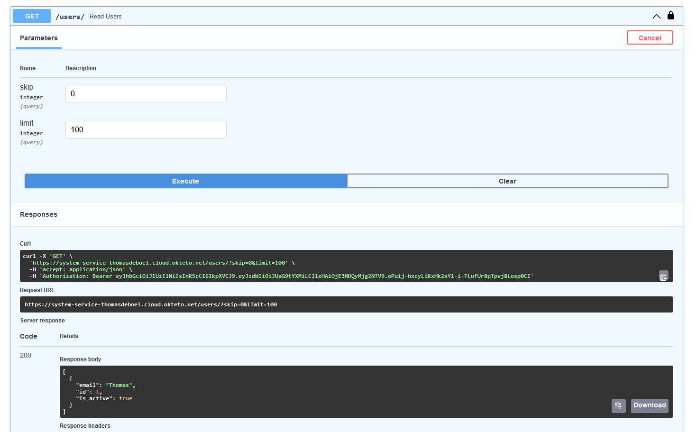
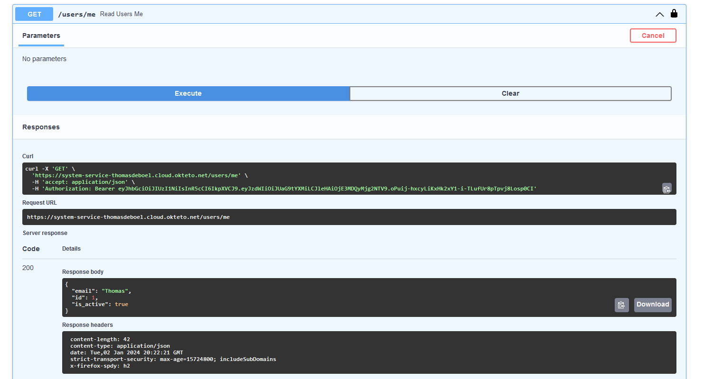

## Overview
This project is about managing and tracking keyboards. The API allows you to create, read, update, and delete keyboard data. The data includes the makers, the keyboard name and the type of switches.

## Features
- create read and delete keyboard data
- create read update and delete maker data
- create read and delete switch data
- create a user for oauth2 authentication

## API Endpoints
- `/merken` GET: get all the makers
- `/merken/{id}` GET: get a specific maker
- `/merken` POST: create a new maker
- `/merken/{id}` PUT: update a maker
- `/merken/{id}` DELETE: delete a maker
- `/keyboards` GET: get all the keyboards
- `/keyboards/{id}` GET: get a specific keyboard
- `/keyboards` POST: create a new keyboard
- `/keyboards/{id}` DELETE: delete a keyboard
- `/switches` GET: get all the switches
- `/switches/{id}` GET: get a specific switch
- `/switches` POST: create a new switch
- `/switches/{id}` DELETE: delete a switch
- `/users` GET: get all the users
- `/users/{id}` GET: get a specific user
- `/users` POST: create a new user
- `/users/{id}` DELETE: delete a user
- `/users/me` GET: get the current user 

## Screenshots
- `/merken` GET: 
- `/merken/{id}` GET: 
- `/merken` POST: 
- `/merken/{id}` PUT: 
- `/merken/{id}` DELETE: 
- `/keyboards` GET: 
- `/keyboards/{id}` GET: 
- `/keyboards` POST: 
- `/keyboards/{id}` DELETE: 
- `/switches` GET: 
- `/switches/{id}` GET: 
- `/switches` POST: 
- `/switches/{id}` DELETE: 
- `authentication` screenshot: 
- `authorized` screenshot: 
- `/users` GET: 
- `/users/{id}` GET: 
- `/users` POST: 
- `/users/{id}` DELETE: 
- `/users/me` GET: 

## Task list
### Algemee eisen & Documentatie
- [x] Minstens 3 GET, 1 POST, 1 PUT en 1 DELETE endpoints
- [x] Minstens 3 entiteiten in je API via een SQLite databank
- [x] Minstens hashing en OAuth implementeren
- [x] Beschrijving van het gekozen thema, je API(s) en je uitbreidingen + link naar de zaken die hosted zijn op GitHub README.md
- [x] Aantoonbare werking totale API door screenshots van Postman requests op GitHub README.md
- [x] Volledige OpenAPI docs screenshot(s) op GitHub README.md
- [x] Logisch gebruik van path parameters, query parameters en body
- [x] Docker container voor de API, welke automatisch door GitHub Actions opgebouwd wordt
- [x] Deployment van de API container op Okteto Cloud via Docker Compose
- [x] Test alle GET endpoints van een van je APIs via de Requests en pytest library met een testfile in de root van je repository.
### aanvulling: functie
- [x] Test alle niet-GET endpoints.
- [ ] Zorg ervoor dat de testfile ook tijdens de GitHub Actions gerund wordt. (dit heb ik geprobeerd maar het is niet gelukt)

